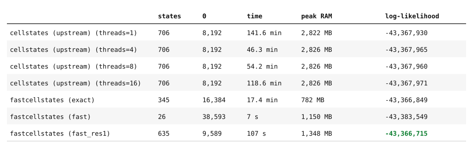
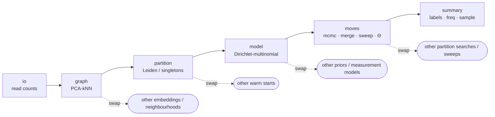

# What this fork changes, and why

This `fastcellstates` reimplements `cellstates` with **numba** as the backend instead of Cython.
The goal is better readability, a smaller maintenance burden and automatic threading.

The model remains unchanged and works the same as described in [Grobecker et al.](#grobeckerIdentifyingCellStates2024).
`fastcellstates` can be run with different presets. For instance, the `exact` preset reproduces the original algorithm, and the numba kernels are checked against a pure-numpy reference (`model/_dm_reference.py`) and a frozen golden file.

Everything below describes the speed-ups and decisions that make `cellstates` fast enough to actually iterate with on large datasets.

## How much faster, in practice

On `pbmc3k` (2,700 cells, filtered as in `docs/notebooks/getting_started.ipynb`), each tool at its own default end-to-end behaviour (both fit Theta by default; the original's thread count is swept explicitly rather than fixed to one setting), all runs on the same node hardware family:

<p align="center"></p>

`fastcellstates exact`, the directly comparable from-singletons search, is 2.7x faster than the original's best thread count (4 threads) and 8x faster than its 1-thread default, at about a third of the peak memory. `fastcellstates fast` at `--cfg.init.resolution 1.0` reaches the best log-likelihood of everything tested, including the original, in under two minutes. See `benchmarks/bench_vs_upstream/README.md` for the full methodology (hardware matching, thread sweep, why fastcellstates gets sparse input and the original dense) and how to reproduce it.

## The likelihood, and a cheap observation

For a partition $\rho$ of cells into subsets $s$, with the Dirichlet prior fixed
to $\vec{\theta} = \Theta\vec{\phi}$ ($\vec{\phi}$ the genome-wide UMI fractions, $\Theta$ the one
free scale factor), the marginal likelihood is (supp. info eq. 15):

$$P(D\mid\rho,\Theta)=\prod_{s\in\rho}\left[\frac{\Gamma(\Theta)}{\Gamma(N_{s}+\Theta)}\prod_{g}\frac{\Gamma(n_{gs}+\Theta\phi_{g})}{\Gamma(\Theta\phi_{g})}\right]$$

where $n_{gs}$ is the summed UMI count of gene $g$ over subset $s$ and
$N_s=\sum_g n_{gs}$. In log form, per subset:

$$\log P(D_s\mid\Theta) = B - \log\Gamma(N_s+\Theta) + \sum_g \log\Gamma(\Theta\phi_g + n_{gs}), \qquad B = \log\Gamma(\Theta) - \sum_g \log\Gamma(\Theta\phi_g)$$

Moving one cell $c$ between subsets changes $n_{gs}$ only for genes with
$n_{gc} > 0$. Every other gene's $\Gamma(\Theta\phi_g + n_{gs})$ term is
untouched, so the change in log-likelihood is a sum over the **non-zero genes of that one cell**, not all $G$.

scRNA-seq count matrices are ~90–95% zeros, so working from the sparse matrix and only visiting a cell's expressed genes
is a large constant-factor win for every move, merge, and sweep step, with *no change* to the result. This is most of the single-threaded speed-up.

## Skipping the MCMC: a Leiden warm start

In practice, the sparse updates were not enough on their own.

Going back to the original goal of the MCMC, it exists only to hand the Bayesian model a good partition to score and refine. Indeed, after the MCMC search, the base `cellstates` completes its optimization with a last *uphill* walk as described [below](#after-the-warm-start-the-same-bayesian-optimisation).

Looking at the paper's own benchmarking (Fig 2B), it shows that a much simpler method, [`SuperCell`](#bilousMetacellsUntangleLarge2022), a graph-coarsening approach on normalized log-expression reaches nearly the same homogeneity as cellstates at the same cluster count
(it loses mainly on completeness, *i.e.* it over-splits less cleanly).

Therefore, we propose to add a path where the MCMC is skipped entirely and the search starts from a **Leiden over-partition** instead of from singletons. The graph construction follows [standard single-cell practice](#heumosBestPracticesSinglecell2023): normalize to median library size, `log1p`,
z-score genes, PCA (50 components), exact Euclidean kNN with $k=30$; `leiden` clustering is then run on the undirected kNN graph. The goal is to speed up the emergence of first structure, so it only has to *over*-segment. The final *uphill* walk then finds where to stop.

### Why CPM as the default objective

`leiden` clustering can be run with different algorithms under the hood.
We use Leiden's *Constant Potts Model*.
Its resolution parameter has the desirable property of a size-independent meaning: it is a threshold on
internal edge density, so a community survives if its density exceeds the threshold.

The same value therefore transfers across datasets of very different size without re-tuning.

Alternatively, *Modularity* / *RBConfiguration* has a resolution limit that
depends on total graph weight, so its effective granularity drifts with the
number of cells. We think the CPM resolution is the more principled knob.

**Other options we cover** (`--cfg.init.algorithm`):

| value | what it is |
|---|---|
| `cpm` (default) | Leiden / Constant Potts Model |
| `leiden_rbc` | Leiden / RBConfiguration (modularity-style) |
| `walktrap` | random-walk agglomerative dendrogram, cut to a target count; the most SuperCell-like option |

Starting from `singletons` (`--cfg.init.source singletons`) recovers the
original from-scratch search.

### The cost of the warm start

This warm start introduces hyperparameters that the original
cellstates deliberately did not have:

- Number of neighbours $k$
- Number of principal components
- Leiden resolution

That runs against the original philosophy: one model, one assumption, one objective, no dials to turn, and the *"slow science"* argument behind it. We agree with that philosophy in principle. But in practice the from-singletons MCMC is slow enough on larger datasets that it stops being a tool you can iterate with, on a problem where we are not even certain cellstates is the right answer yet. The warm start is the pragmatic choice; the exact path stays available for when it matters.

## After the warm start: the same Bayesian optimisation

The warm start only supplies an initial partition. The Dirichlet-multinomial objective still drives
everything after it:

- the agglomerative **merge**: for every pair of clusters, it computes the
  likelihood change upon merging and iterates the best merge while it is positive;
- a deterministic **cell sweep**: for each cell, move it to the cluster that
  most increases the likelihood.

The original algorithm's final uphill walk does one **Gauss-Seidel** sweep (cells
updated in sequence, each seeing the previous moves). This fork iterates the
sweep to convergence and defaults to a **Jacobi** variant: score every cell
against the frozen state in parallel, then apply the improving moves in
descending order. Same fixed point, better use of cores. Gauss-Seidel stays
available and is what the `exact` preset uses.

The merge parallelises for a different reason. Its cost is the $\binom{K_0}{2}$
pairwise scores

$$\sigma_{ab} = \log P(D_{a\cup b}\mid\Theta) - \log P(D_a\mid\Theta) - \log P(D_b\mid\Theta),$$

and $\log P(D_s\mid\Theta)$ depends only on the summed counts of subset $s$, so
each $\sigma_{ab}$ is independent of every other pair: a *map*, computed across
cores with no reformulation. Only the greedy selection on top (take the largest
$\sigma$, merge, repeat) is sequential. Same closed-form-in-the-sufficient-
statistics that gives the $O(\text{genes per cell})$ move deltas.

Additionally, the sweep supports a **kNN-pruned candidate set**: restrict each
cell's move targets to the clusters of its nearest neighbours (plus one empty
box, so a cell can still be split off on its own). In practice an accepted sweep
move almost always sends a cell to a cluster that already holds one of its
nearest neighbours, so scanning only those is near-lossless after a warm start.
We use a wider neighbourhood here than for the `leiden` graph ($k=100$) to
leave room for the rare longer jump. This is on by default in the `fast` preset
(`--cfg.moves.sweep_prune_k`).

Overall `{gauss_seidel | jacobi} × {full | kNN-pruned}` are all valid combinations.

## Fitting Theta: coordinate ascent, doubling, and a Brent search

Theta is not fixed either: `--cfg.model.theta_method` fits it alongside the
partition, alternating (recluster at the current Theta) with (refit Theta at
the current partition, a Minka fixed-point MLE). Every recluster starts over
from the same starting partition (the Leiden over-partition, or singletons),
never from a previous round's result: the partition search explored at one
Theta should not depend on what a different Theta's search happened to
converge to.

Three strategies drive the alternation:

- `coordinate_ascent`: the Minka fixed-point step is exact for the current
  partition, but reclustering is a fresh, independent search each round, so
  nothing guarantees the alternation is monotonic in the likelihood; it
  tracks and returns the best `(theta, cluster)` seen across all rounds
  rather than whichever round happened to run last.
- `doubling`: the original paper's search. Probe Theta x2 (or /2) while it
  improves the total likelihood, then stop; optimal only up to a factor of
  2, and it never bisects inside a gap.
- `log_search` (default): Brent's method over log(Theta)
  (`scipy.optimize.minimize_scalar`): bracket the maximum, then refine with
  golden-section search plus parabolic interpolation. It scores
  `total_likelihood` directly rather than trusting the Minka fixed-point as
  a proxy for it, and it is not capped to a power-of-2 grid the way
  `doubling` is. Matches or beats both of the above in practice, typically
  at lower cost.

## Sampling utilities

The original writes out the partition, the hierarchy, and marker scores. This
fork also produces a `Summary`: the labels plus, per cell-state, the posterior
Dirichlet parameters $\Theta\phi_g + n_{gs}$ (supp. info eq. 18), the mixing
weights, and a library-size model. From it you can `.sample()` fresh cells,
`.reconstruct()` the input at its own depths, and `.predict_state()` for
held-out cells. It is a compact generative object you can keep instead of
re-running.

`.sample()`'s default draws a fresh $\alpha_{gs} \sim
\mathrm{Dirichlet}(\Theta\phi_g + n_{gs})$ per cell before the multinomial
draw: the actual posterior predictive, not a single plug-in point estimate.
Plugging in the posterior mean $\langle\alpha_{gs}\rangle = (\Theta\phi_g +
n_{gs}) / (\Theta + N_s)$ (eq. 20) or mode (eq. 19) instead is cheaper but
understates a state's remaining uncertainty (eq. 21): every cell of a state
is then drawn around the identical frequency vector, visibly tighter than
real cells in, e.g., a UMAP. Both are available via `estimator="mean"` /
`"mode"`.

## Scaling past memory

The search assumes the whole `(genes, cells)` matrix fits in memory: the
merge and sweep/MCMC machinery repeatedly revisit individual cells in
essentially random order, which does not suit reading them lazily from disk.
That is a deliberate scope limit, not an oversight: making the search itself
out-of-core would mean rewriting how the kernels touch data, for an uncertain
payoff against random-access I/O.

The practical answer instead: fit a `Summary` on a subsample that does fit in
memory, then `Summary.predict_state` (an independent per-cell argmax against
the fitted states) assigns every remaining cell, streamed in chunks straight
from disk via `io.peek_h5ad` / `io.read_h5ad_subset` / `io.iter_h5ad_chunks`
(backed by AnnData's own `backed="r"` mode). See
`docs/notebooks/large_datasets.ipynb` for the full walkthrough, including why
a subsample's fit can miss rare states and what that costs you.

## Deferred and removed

**`add_dataset` (removed).** The original had a script to fold new cells into an
existing run by freezing the old cells' assignments and only searching over the
new ones. We removed it because freezing assignments is probably not the right
model for incremental data: it is unclear whether new cells should be allowed to
merge old clusters, whether $\Theta$ should be re-fit jointly, and whether old cells
should be anchored softly rather than frozen. This is worth a re-exploration as
future work.

**kNN-restricted MCMC moves (deferred).** The paper suggests biasing MCMC
proposals towards a cell's neighbours to speed convergence. We experimented with
this and did not find a variant that was clearly worth the added complexity and
the loss of exactness. More to the point: if the goal of a restricted proposal
is to reach a good partition faster, seeding the search with a `leiden` partition
is a more direct way to get there. Left as an explored-but-not-adopted option.

**Pyro/SVI mixture as an alternative search (explored, not adopted).** Same
Dirichlet-multinomial generative model, fit as a truncated stick-breaking
mixture via Pyro (enumeration for the discrete assignment, SVI or closed-form
CAVI for the continuous parameters) instead of the exact combinatorial search
-- motivated by SVI's minibatch scalability, which the current in-memory,
per-cell merge/sweep machinery doesn't have. Across a fairly wide sweep (Adam
vs. closed-form CAVI, flat vs. singleton-style real-cell initialisation,
Theta fixed/co-adapted/gradient/line-search) on `pbmc3k`, nothing beat the
existing `fast` preset end to end; the best result only got close (within
0.03% of the tuned baseline's log-likelihood) by handing its raw partition to
the *existing* merge+sweep machinery anyway, not from the SVI fit itself. The
one axis this never actually tested -- a dataset large enough that the exact
search's in-memory assumptions start to strain -- is also the only place SVI
would have a structural advantage, and is the natural place to revisit this.
Full write-up, code, and every intermediate result:
[`experiment/pyro-mixture`](https://github.com/HugoHakem/fastcellstates/tree/experiment/pyro-mixture/experiments/pyro_mixture).

## A note on single-cell states

The paper argues that the many singlet cell-states the model finds reflect
genuine biological diversity that current sequencing depth under-samples. Our
fast path is less able to isolate singlets: a `leiden` over-partition plus a
kNN-pruned sweep will not reliably peel every single-cell state out of its
neighbourhood.

We think this is a real limitation but a mild one. A single cell whose counts
differ from all others is about as consistent with capture noise as with a
distinct gene expression state, and either way there is little to conclude from
an $n=1$ cluster on its own. If you specifically care about the singlet tail,
use the `exact` preset.

## Composable by design

This reimplementation is modular by design.



Each block is a small module with a narrow interface. The graph and partition
blocks are search heuristics: they never enter the likelihood, so a poor
neighbour choice costs a missed candidate, never a wrong answer. The model block
is the one place the generative assumptions live. Swapping the Dirichlet prior for a
non-conjugate one is the one change that also rewrites the move machinery,
because the $O(\text{genes per cell})$ incremental updates depend on conjugacy.

## References

<a id="grobeckerIdentifyingCellStates2024"></a>

```bibtex
@article{grobeckerIdentifyingCellStates2024,
  title = {Identifying Cell States in Single-Cell {{RNA-seq}} Data at Statistically Maximal Resolution},
  author = {Grobecker, Pascal and Sakoparnig, Thomas and family=Nimwegen, given=Erik, prefix=van, useprefix=false},
  date = {2024-07-12},
  journaltitle = {PLOS Computational Biology},
  doi = {10.1371/journal.pcbi.1012224},
  url = {https://journals.plos.org/ploscompbiol/article?id=10.1371/journal.pcbi.1012224},
}
```

<a id="bilousMetacellsUntangleLarge2022"></a>

```bibtex
@article{bilousMetacellsUntangleLarge2022,
  title = {Metacells Untangle Large and Complex Single-Cell Transcriptome Networks},
  author = {Bilous, Mariia and Tran, Loc and Cianciaruso, Chiara and Gabriel, Aurélie and Michel, Hugo and Carmona, Santiago J. and Pittet, Mikael J. and Gfeller, David},
  date = {2022-08-13},
  journaltitle = {BMC Bioinformatics},
  doi = {10.1186/s12859-022-04861-1},
  url = {https://doi.org/10.1186/s12859-022-04861-1},
}
```

<a id="heumosBestPracticesSinglecell2023"></a>

```bibtex
@article{heumosBestPracticesSinglecell2023,
  title = {Best Practices for Single-Cell Analysis across Modalities},
  author = {Heumos, Lukas and Schaar, Anna C. and Lance, Christopher and others},
  date = {2023-03-31},
  journaltitle = {Nature Reviews Genetics},
  doi = {10.1038/s41576-023-00586-w},
  url = {https://doi.org/10.1038/s41576-023-00586-w},
}
```
